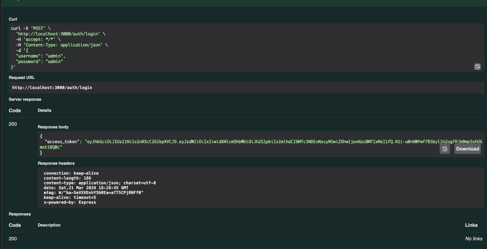
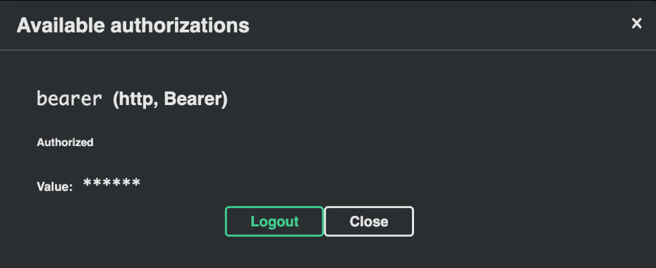
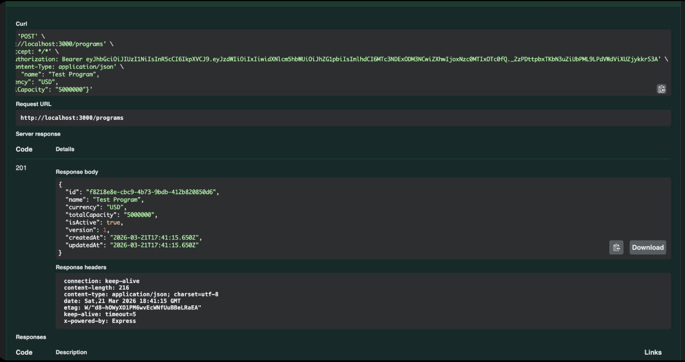
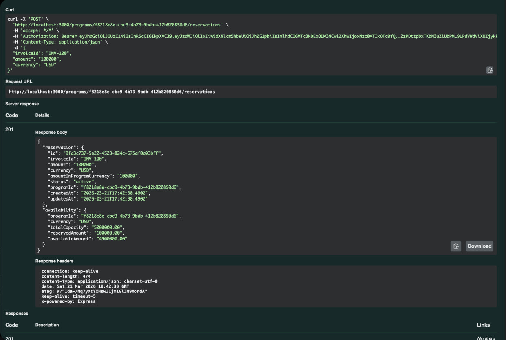
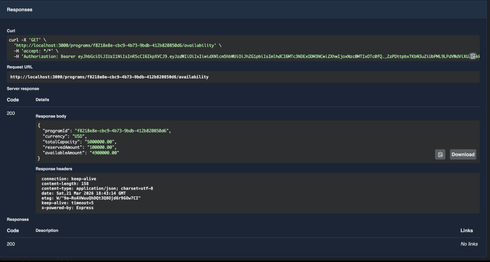
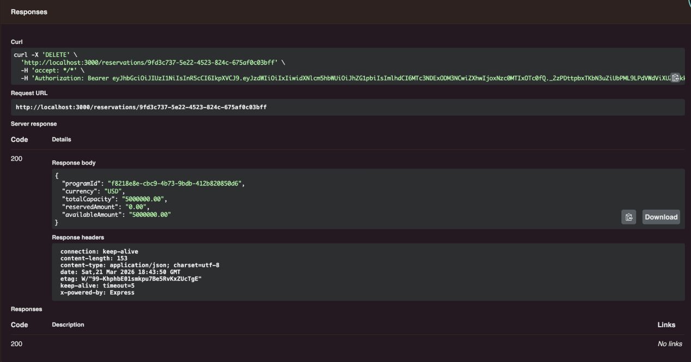

# Program Capacity & Invoice Reservation Service

## Prerequisites

- **Docker Desktop** ([download](https://www.docker.com/products/docker-desktop/))
- **Node.js 18+** - only for Option B
  - [Official installer](https://nodejs.org/)
  - Or via nvm: `nvm install 18`
  - Or via brew: `brew install node`

## Startup

### Option A: Everything in Docker (recommended)

1. Open Docker Desktop (wait until it shows "running")
2. Run:
```bash
make start
```

If `make` is not available:
```bash
docker compose up -d --build
```

### Option B: App locally + infra in Docker

```bash
# 1. Open Docker Desktop first! Wait until it shows "running"

# 2. Start infrastructure
docker compose up -d postgres kafka zookeeper

# 3. Wait for database to be ready
docker compose ps postgres
docker compose exec postgres pg_isready -U capacity -d capacity_db

# 4. Install dependencies and start app
cp .env.example .env
npm install
npm run start:dev
```

**Important:** Do not run both options at the same time.

## Stop

```bash
make stop
```

Or:
```bash
docker compose down
```

## Verification

1. Open Swagger UI: **http://localhost:3000/api**

2. Test auth:
   - Click `POST /auth/login` → "Try it out"
   - Enter: `{"username": "admin", "password": "admin"}`
   - Click "Execute"
   - You should get `200` with `access_token`

## Troubleshooting

### Error: `ECONNREFUSED ...5432`

**Why:** Database is not running.

**Fix:** Restart everything:
```bash
docker compose down -v
docker compose up -d
```
Wait 10 seconds, then try again.

### Error: Port already in use

**Why:** Another process is using the port (5432 for PostgreSQL, 3000 for app, 9092 for Kafka).

**Find what's using the port:**
```bash
lsof -i :5432    # PostgreSQL
lsof -i :3000    # App
lsof -i :9092    # Kafka
```

**Kill the process:**
```bash
kill -9 <PID>
```

**Or stop local PostgreSQL (if installed via brew):**
```bash
brew services stop postgresql
```

### Error: Docker is not running

**Fix:** Open Docker Desktop and wait until it shows "running" (green icon).

## How to Test (step by step)

### Step 1: Get token

1. Click on `POST /auth/login`
2. Click "Try it out"
3. Enter:
```json
{
  "username": "admin",
  "password": "admin"
}
```
4. Click "Execute"
5. Copy the token from response (the long text after `"access_token":`)



### Step 2: Authorize

1. Click "Authorize" button (top right, with lock icon)
2. Paste the token **WITHOUT QUOTES** (just `eyJhbGci...`, not `"eyJhbGci..."`)
3. Click "Authorize"
4. Click "Close"



### Step 3: Create a program

1. Click on `POST /programs`
2. Click "Try it out"
3. Enter:
```json
{
  "name": "Test Program",
  "currency": "USD",
  "totalCapacity": "5000000"
}
```
4. Click "Execute"
5. Copy the `id` from response



### Step 4: Create a reservation

1. Click on `POST /programs/{programId}/reservations`
2. Click "Try it out"
3. Paste the program `id` in the `programId` field
4. Enter:
```json
{
  "invoiceId": "INV-100",
  "amount": "100000",
  "currency": "USD"
}
```
5. Click "Execute"
6. See: `reservedAmount: 100000`, `availableAmount: 4900000`



### Step 5: Check availability

1. Click on `GET /programs/{id}/availability`
2. Click "Try it out"
3. Paste the program `id`
4. Click "Execute"
5. See current capacity



### Step 6: Release reservation

1. Click on `DELETE /reservations/{id}`
2. Click "Try it out"
3. Paste the reservation `id`
4. Click "Execute"
5. See: capacity is back to full



## Project Info

| Feature | Description |
|---------|-------------|
| Capacity tracking | Track credit limits for financing programs |
| Reservations | Reserve/release capacity for invoices |
| Multi-currency | Automatic currency conversion |
| Kafka integration | Receive updates from treasury system |
| JWT auth | All endpoints secured |

## Kafka Topics

- `capacity.update` - capacity updates from treasury
- `capacity.reconciliation` - full state sync

## Tests

```bash
npm test
# Test Suites: 3 passed
# Tests: 16 passed
```

## License

MIT
